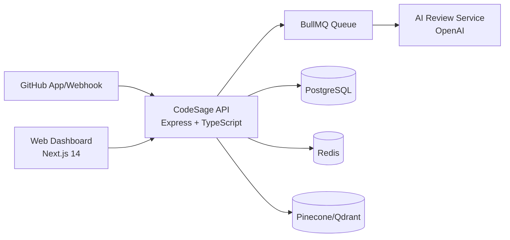

# CodeSage

> AI-powered code review and engineering knowledge platform.  
> 面向研发团队的 AI 代码审查与知识管理平台。

[](https://github.com/cntzj/CodeSage/releases)
[](./LICENSE)

## 1. Overview | 项目概览

**EN**: CodeSage integrates AI review, knowledge graph extraction, and technical debt tracking into a single workflow for pull requests and repository governance.  
**中文**：CodeSage 将 AI 审查、知识图谱提取和技术债务追踪整合到统一研发流程中，用于提升 PR 质量和工程治理效率。

### Value Proposition | 核心价值

- **EN**: Reduce manual review load with automated PR risk analysis.
- **中文**：通过自动化 PR 风险分析，降低人工审查成本。

- **EN**: Turn implicit codebase knowledge into searchable, visualized assets.
- **中文**：将隐性代码知识沉淀为可搜索、可视化资产。

- **EN**: Continuously detect and prioritize technical debt from source code comments and patterns.
- **中文**：持续识别并量化技术债务，支持优先级管理。

## 2. Core Capabilities | 功能能力

1. **AI Reviewer Engine**
- **EN**: Webhook-triggered PR review with structured JSON findings (risk, issues, suggestions).
- **中文**：通过 Webhook 自动触发 PR 审查，输出结构化风险与问题建议。

2. **Knowledge Graph**
- **EN**: AST-based entity extraction + semantic retrieval.
- **中文**：基于 AST 的代码实体抽取与语义检索。

3. **Debt Tracker**
- **EN**: TODO/FIXME/HACK scanning, scoring, and Kanban-style debt board.
- **中文**：TODO/FIXME/HACK 扫描、风险评分与看板化管理。

4. **Web Dashboard**
- **EN**: Unified UI for PRs, graph exploration, semantic search, debt board, and settings.
- **中文**：统一工作台覆盖 PR、图谱、智能搜索、债务看板和配置管理。

## 3. Architecture | 架构设计



## 4. Repository Layout | 仓库结构

```text
.
├── backend/
│   ├── src/
│   │   ├── config/           # env/logger/redis/prisma/swagger
│   │   ├── controllers/      # REST + webhook controllers
│   │   ├── middlewares/      # trace-id, error handler, webhook verify
│   │   ├── services/         # ai/github/knowledge/debt
│   │   ├── queues/           # review queue + worker
│   │   ├── routes/           # API routes
│   │   └── utils/            # parser/cache/retry helpers
│   ├── prisma/schema.prisma
│   └── tests/
├── frontend/
│   ├── app/(dashboard)/      # dashboard routes
│   ├── components/           # UI & domain components
│   ├── lib/                  # API client/hooks
│   └── types/
├── .github/workflows/ci.yml
├── docker-compose.yml
└── AGENTS.md
```

## 5. Tech Stack | 技术栈

### Backend
- Node.js 20, TypeScript, Express
- Prisma, PostgreSQL
- BullMQ, Redis
- Octokit (GitHub App integration)
- OpenAI API

### Frontend
- Next.js 14 (App Router), TypeScript
- Tailwind CSS
- Cytoscape.js, Recharts
- Zustand

### DevOps
- Docker, Docker Compose
- GitHub Actions CI
- Swagger/OpenAPI

## 6. Quick Start | 快速开始

### 6.1 Prerequisites | 前置条件

- Node.js `>= 20`
- pnpm (backend), npm (frontend)
- Optional for full mode: PostgreSQL / Redis / OpenAI key / GitHub App credentials
- 完整模式需要 PostgreSQL、Redis、OpenAI Key 和 GitHub App 凭据

### 6.2 Backend (Mock Mode) | 后端（演示模式）

```bash
cd backend
cp .env.example .env
pnpm install
pnpm prisma:generate
pnpm dev
```

- API: `http://localhost:4000`
- Swagger: `http://localhost:4000/docs`

### 6.3 Frontend

```bash
cd frontend
cp .env.example .env.local
npm install
npm run dev
```

- Dashboard: `http://localhost:3000`

### 6.4 Docker Compose | 一键编排

```bash
docker compose up --build
```

## 7. Configuration | 配置说明

### Key Environment Variables | 关键环境变量

| Variable | Description (EN) | 说明（中文） |
|---|---|---|
| `USE_MOCK_DATA` | Run with local mock dataset | 是否使用本地模拟数据 |
| `DATABASE_URL` | PostgreSQL connection string | PostgreSQL 连接串 |
| `REDIS_URL` | Redis connection URL | Redis 连接地址 |
| `OPENAI_API_KEY` | OpenAI API credential | OpenAI 访问密钥 |
| `GITHUB_APP_ID` | GitHub App ID | GitHub App 标识 |
| `GITHUB_PRIVATE_KEY` | GitHub App private key | GitHub App 私钥 |
| `GITHUB_WEBHOOK_SECRET` | Webhook signature secret | Webhook 验签密钥 |

## 8. API Overview | 接口概览

### Webhook
- `POST /webhooks/github`

### Projects
- `GET /api/projects`
- `GET /api/projects/:id`
- `POST /api/projects`
- `PUT /api/projects/:id/config`
- `DELETE /api/projects/:id`

### Pull Requests
- `GET /api/projects/:id/pull-requests`
- `GET /api/projects/:id/pull-requests/:prNumber`
- `GET /api/pull-requests/:id`
- `GET /api/pull-requests/:id/review`
- `POST /api/pull-requests/:id/review`

### Knowledge & Search
- `GET /api/projects/:id/knowledge/nodes`
- `GET /api/projects/:id/knowledge/graph`
- `GET /api/knowledge/search?q=...`

### Tech Debt
- `GET /api/projects/:id/debts`
- `GET /api/projects/:id/debts/stats`
- `PUT /api/debts/:id`

## 9. Development Workflow | 开发流程

```bash
# Backend
cd backend
pnpm lint
pnpm test
pnpm build

# Frontend
cd frontend
npm run lint
npm run build
```

**Branching policy | 分支策略**
- Work on feature branches (recommended prefix: `codex/`).
- Use PRs into `main` with review.
- 建议使用 `codex/` 前缀特性分支，通过 PR 合并到 `main`。

## 10. CI/CD | 持续集成

- GitHub Actions workflow: `/.github/workflows/ci.yml`
- Backend checks: install, prisma generate, lint, test, build
- Frontend checks: install, lint, build

## 11. Security | 安全说明

- See [SECURITY.md](./SECURITY.md) for disclosure and hardening guidance.
- 详细安全策略与漏洞提交流程见 [SECURITY.md](./SECURITY.md)。

## 12. Roadmap | 路线图

- **v0.2.x**: richer review policies, stronger queue observability, better RAG quality
- **v0.3.x**: deeper GitHub interactions, collaboration features, production hardening
- **v0.2.x**：增强审查规则与队列可观测性，提升语义检索质量
- **v0.3.x**：增强 GitHub 交互能力、协作功能与生产级稳定性

## 13. Contributing | 贡献指南

- Open issues or pull requests for bug fixes and feature proposals.
- Keep commits aligned with Conventional Commits (`feat:`, `fix:`, `docs:`, etc.).
- 欢迎提交 Issue / PR，提交信息请遵循 Conventional Commits 规范。

## 14. License

MIT
